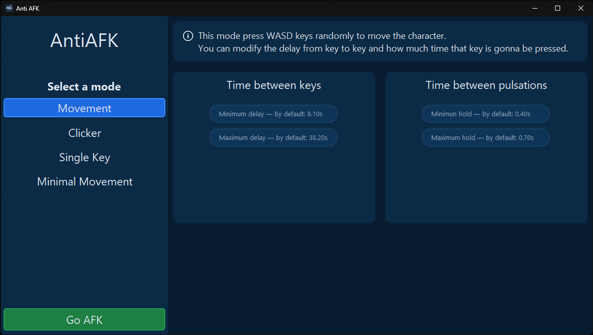
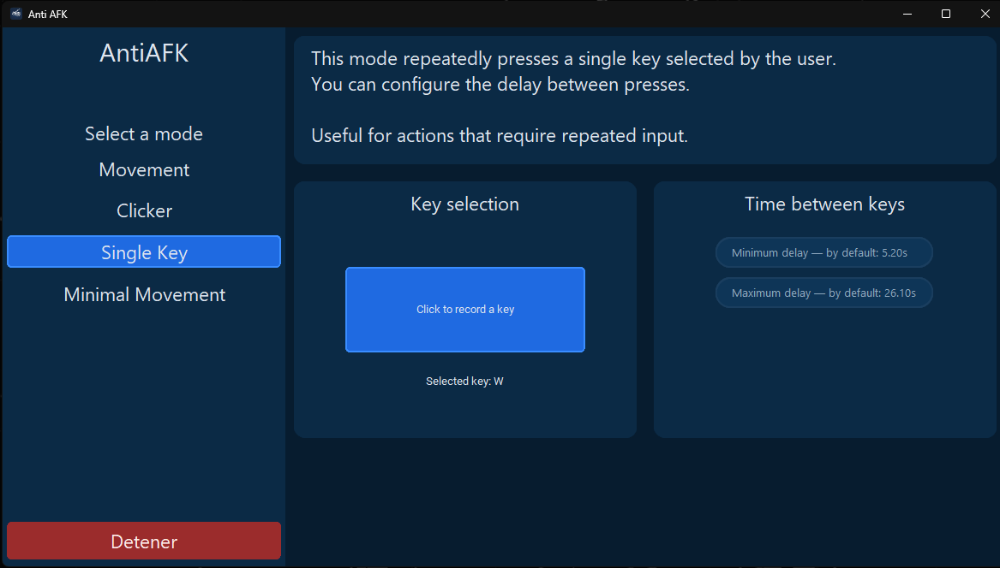

# 💤 AntiAFK

AntiAFK is a desktop application designed to prevent AFK detection in games and applications by simulating user input.

## ✨ Features
- WASD random movement
- Mouse auto clicker
- Single key spam with custom delay
- Minimal movement mode (low detection)

## 🖥️ Screenshots

## 📦 Download
Download the latest Windows executable from the **Releases** section.

## 🛠️ Built With
- Python
- CustomTkinter
- PyInstaller

